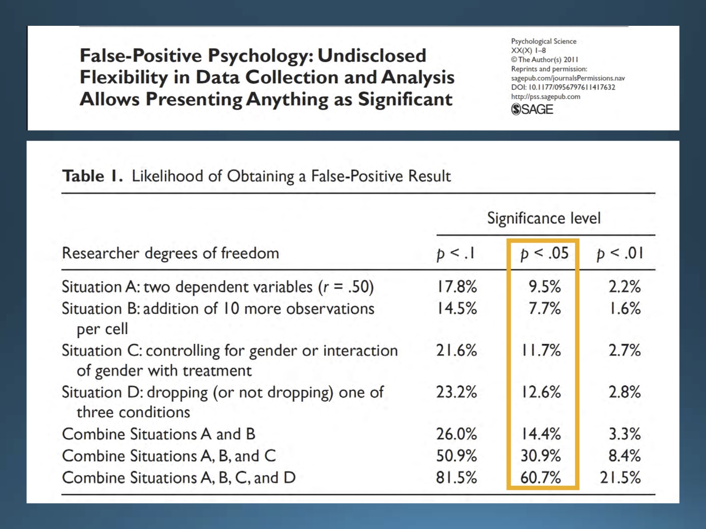
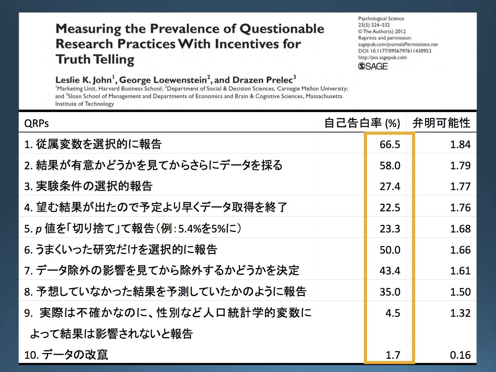
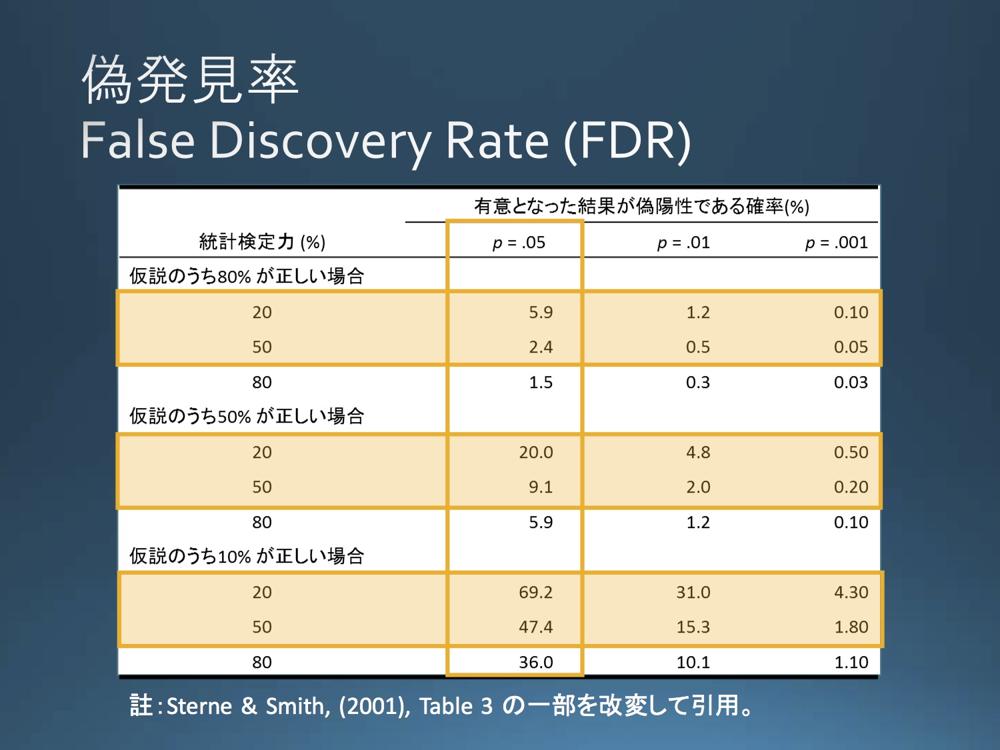

```{r echo=FALSE}
a=function(u)paste0("<a href='", u, "' target='_blank'>", u, "</a>")
```

<link rel="stylesheet" href="https://cdnjs.cloudflare.com/ajax/libs/mediaelement/2.23.4/mediaelementplayer.min.css">

<a href="https://twitter.com/share?ref_src=twsrc%5Etfw" class="twitter-share-button" data-hashtags="TodaRadio" data-show-count="false">Tweet</a><script async src="https://platform.twitter.com/widgets.js" charset="utf-8"></script>


- ハッシュタグ`#TodaRadio`でお願いします（↑のボタンから行けます）。

※ 本ラジオでの発言は個人の見解であり、所属する組織の見解ではありません。

※ 科学的な正しさを重視して発言していますが、発言には誤りが含まれることもありえます。

※ ご意見、苦情などありましたら高橋までメール takahashi.kohske@gmail.com またはツイッター [\@kohske](https://twitter.com/kohske) までご連絡ください。

----

- 収録日: 2018/01/04
- 場所: [SOUL INC.](https://tabelog.com/aichi/A2301/A230103/23054005/)
- メンバー
    - コメンテーター: 池田さん
    - パーソナリティ: 高橋


## 前半

- イントロ（新年の抱負）
- 名前の由来
- お便りの返答
- QRPの具体的な状況など

<audio class="mejs-player" controls="" data-mejsoptions='{"alwaysShowControls": true, "alwaysShowHours": true, "enableAutosize": true, "features": ["playpause", "progress", "current", "duration", "volume", "speed"]}' preload="auto" src="audio/vol002_1.mp3" width="100%"></audio>

[MP3ファイルをダウンロード](audio/vol002_1.mp3)


----

## 後半

- プレレジの実際
- 高橋Questions

<audio class="mejs-player" controls="" data-mejsoptions='{"alwaysShowControls": true, "alwaysShowHours": true, "enableAutosize": true, "features": ["playpause", "progress", "current", "duration", "volume", "speed"]}' preload="auto" src="audio/vol002_2.mp3" width="100%"></audio>

[MP3ファイルをダウンロード](audio/vol002_2.mp3)


----


## ラジオの時系列順にポインタ（前半）

###　イントロ

- 戸田正直 `r a("https://ja.wikipedia.org/wiki/%E6%88%B8%E7%94%B0%E6%AD%A3%E7%9B%B4")`
- 感情 `r a("https://www.amazon.co.jp/dp/4130151592")`
- 認知科学会シンポジウム `r a("https://kohske.github.io/research/JCSS2017OS/")`

- Science 2015: `r a("http://science.sciencemag.org/content/349/6251/aac4716")`
    - 3つのHigh-impact journalで2008年に出版されたものから対象を選択。
- 山田さん `r a("https://sites.google.com/site/jyamadayuk/")`


### QRPについて

- Simmons (2011) False Positive Psychology: `r a("http://journals.sagepub.com/doi/abs/10.1177/0956797611417632")`
- 心理学評論 池田平石論文 `r a("http://team1mile.com/sjpr59-1/contents_original/ikeda_hiraishi2016/")`
    - 追加的ノート `r a("https://goo.gl/nK8EXH")`
- 日本社会心理学会第56回大会WS `r a("https://osf.io/g6whz/")`
    - 池田スライド `r a("https://osf.io/v78cj/")`



1個目の表：QRP、その組み合わせによるαのインフレ



2個目の表：QRPに関する調査

- うそつき村 `r a("https://www.osaka-kyoiku.ac.jp/~hiraki/etc/quiz.htm")`



3個目の表：仮説が正しい確率によるFDRの変化

- 病気である確率 `r a("https://bellcurve.jp/statistics/blog/14190.html")`

- HARKing論文 `r a("http://journals.sagepub.com/doi/abs/10.1207/s15327957pspr0203_4")`

----

## ラジオの時系列順にポインタ（後半）

### プレレジの話

#### サンプルサイズ設計

- 統計WEB `r a("https://bellcurve.jp/statistics/course/12769.html")`
- G*Power `r a("http://www.gpower.hhu.de/")`
- PANGEA `r a("https://jakewestfall.shinyapps.io/pangea/")`
- 「心理学のためのサンプルサイズ設計入門」 `r a("https://www.amazon.co.jp/gp/product/4061565672/")`
- モデル化については緑本 `r a("https://www.amazon.co.jp/dp/400006973X やSTAN関連など。")`
- 同等性検定 `r a("http://www.igaku-shoin.co.jp/paperDetail.do?id=PA02971_04")`
- Sequential analysis (wikiでごめんなさい) `r a("https://en.wikipedia.org/wiki/Sequential_analysis")`
    - Lakenによるスライド＠OSF `r a("https://osf.io/nemgx/")`

#### 心理的バリア

- OSF `r a("https://osf.io/")`
- AsPredicted `r a("https://aspredicted.org/")`
- 2ちゃんねる `r a("https://ja.wikipedia.org/wiki/2%E3%81%A1%E3%82%83%E3%82%93%E3%81%AD%E3%82%8B")`
- プレレジ精神的にいいよという話 `r a("https://rolfzwaan.blogspot.jp/2017/12/my-cattle.html")`
    - "After a while preregistration becomes second nature and it becomes odd not to do it."
- 理論心理学会 `r a("http://www.pat.hi-ho.ne.jp/theo-psy/")`
- ISTP 2017 ＠立教 `r a("https://www2.rikkyo.ac.jp/web/istp2017/index.html")`

#### 制度的バリア

- ごまめの歯ぎしり `r a("https://www.taro.org/category/blog")`

### 高橋Q

- 両側検定と片側検定
- 「ア」がいいです。
- イラスト屋「心理学」 `r a("http://www.irasutoya.com/search?q=%E5%BF%83%E7%90%86%E5%AD%A6")`
- ア・バオア・クー `r a("https://ja.wikipedia.org/wiki/%E3%82%A2%E3%83%BB%E3%83%90%E3%82%AA%E3%82%A2%E3%83%BB%E3%82%AF%E3%83%BC")`
- 阿Q正伝 `r a("https://ja.wikipedia.org/wiki/%E9%98%BFQ%E6%AD%A3%E4%BC%9D")`
- 犬山会議 `r a("https://langint.pri.kyoto-u.ac.jp/langint/news/icbm/index.html")`
- ミウラジオ 三浦先生講演会＠中京大学「SNSから社会の心を読む：「ビッグデータ」の心理学」: `r a("https://www.chukyo-u.ac.jp/event/2017/12/012244.html")`

<script src="https://cdnjs.cloudflare.com/ajax/libs/jquery/3.1.1/jquery.min.js"></script>
<script src="https://cdnjs.cloudflare.com/ajax/libs/mediaelement/2.23.4/mediaelement-and-player.min.js"></script>


