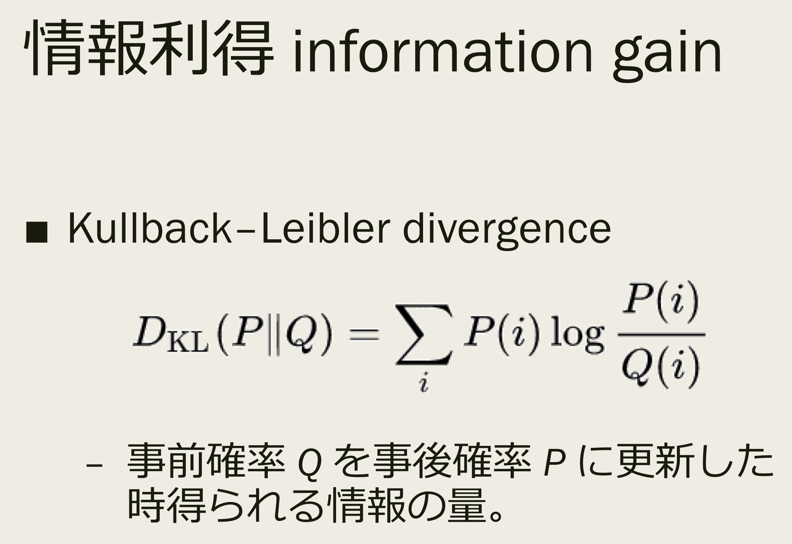

```{r echo=FALSE}
a=function(u)paste0("<a href='", u, "' target='_blank'>", u, "</a>")
```

<link rel="stylesheet" href="https://cdnjs.cloudflare.com/ajax/libs/mediaelement/2.23.4/mediaelementplayer.min.css">

<a href="https://twitter.com/share?ref_src=twsrc%5Etfw" class="twitter-share-button" data-hashtags="TodaRadio" data-show-count="false">Tweet</a><script async src="https://platform.twitter.com/widgets.js" charset="utf-8"></script>


- ハッシュタグ`#TodaRadio`でお願いします（↑のボタンから行けます）。

※ 本ラジオでの発言は個人の見解であり、所属する組織の見解ではありません。

※ 科学的な正しさを重視して発言していますが、発言には誤りが含まれることもありえます。

※ ご意見、苦情などありましたら高橋までメール takahashi.kohske@gmail.com またはツイッター [\@kohske](https://twitter.com/kohske) までご連絡ください。

※ [ディスカッションルーム](discussion.html)もあります。 


----

- 収録日: 2018/03/12
- 場所: [専修大学サテライトキャンパス](https://www.senshu-u.ac.jp/social/satellite/)
- 研究会の案内: [「心理学における再現可能性入門」](https://kunisatolab.github.io/main/intro_reproducible_res.html)
- メンバー
    - ゲスト：[澤さん](http://kujira.psy.senshu-u.ac.jp/~sawa/index.html)・[国里さん](https://kunisatolab.github.io/main/index.html)・公開収録参加者のみなさま
    - コメンテーター: 池田さん
    - パーソナリティ: 高橋

## 概要

- イントロ（澤さん・国里さん自己紹介）
- 臨床心理学者から見た再現可能性問題
- 学習心理学者から見た再現可能性問題
- 動物実験のおけるパラメータ統制の話
- 臨床診断カテゴリと機序研究
- 専修大学での動きなど


<audio class="mejs-player" controls="" data-mejsoptions='{"alwaysShowControls": true, "alwaysShowHours": true, "enableAutosize": true, "features": ["playpause", "progress", "current", "duration", "volume", "speed"]}' preload="auto" src="audio/vol004_1.mp3" width="100%"></audio>

[MP3ファイルをダウンロード](audio/vol004_1.mp3)

----

### 公開収録の様子

<blockquote class="twitter-tweet" data-lang="ja"><p lang="ja" dir="ltr">TODAラジオ収録ちう。 <a href="https://t.co/ywsXdLuYAw">pic.twitter.com/ywsXdLuYAw</a></p>&mdash; 大久保 街亜 / Matia Okubo (@matiasauquebaux) <a href="https://twitter.com/matiasauquebaux/status/973098851992141824?ref_src=twsrc%5Etfw">2018年3月12日</a></blockquote>
<script async src="https://platform.twitter.com/widgets.js" charset="utf-8"></script>


----

## ラジオの時系列順にポインタ

### 自己紹介

- 研究会の案内「心理学における再現可能性入門」 `r a("https://kunisatolab.github.io/main/intro_reproducible_res.html")`
- 澤先生のウェブサイト: `r a("http://kujira.psy.senshu-u.ac.jp/~sawa/index.html")`
- 行動心理学
- 国里先生のウェブサイト: `r a("https://kunisatolab.github.io/main/index.html")`
- 臨床心理学
- 計算論的臨床心理学: `r a("https://www.slideshare.net/YoshihikoKunisato/ss-74207031")`

### 再現可能性問題に対する立ち位置

- 心理学評論の再現可能性特集号 `r a("http://team1mile.com/sjpr59-1/")`
- 編集委員の友永先生: `r a("https://langint.pri.kyoto-u.ac.jp/langint/staff/masaki_tomonaga-j.html")`
- 連合学習についての澤先生の動心論文: `r a("https://www.jstage.jst.go.jp/article/janip/advpub/0/advpub_62.1.4/_article/-char/ja/")`
- 精神医学: `r a("https://ja.wikipedia.org/wiki/%E7%B2%BE%E7%A5%9E%E5%8C%BB%E5%AD%A6")`
- 奥村泰之先生のウェブサイト: `r a("http://blue.zero.jp/yokumura/index.html")`
- 臨床疫学研究における報告の質向上のための統計学の研究会: `r a("http://blue.zero.jp/yokumura/workshop.html")`
- 日本臨床疫学研究会: `r a("http://www.clinicalepi.org/")`
- 異常心理学: `r a("https://ja.wikipedia.org/wiki/%E7%95%B0%E5%B8%B8%E5%BF%83%E7%90%86%E5%AD%A6")`
- CBT（認知行動療法）: `r a("http://cbt.ncnp.go.jp/guidance/about")`

### 効果量のインフレ

- 精神分析学: `r a("https://ja.wikipedia.org/wiki/%E7%B2%BE%E7%A5%9E%E5%88%86%E6%9E%90%E5%AD%A6")`
- パブリケーションバイアス（出版バイアス）
- 古川先生の講義（国里さんより「登録が必要ですが，この『ICR臨床研究入門』は，動画資料も多くて，臨床研究の方法を学ぶのにとても良いです」とのことです）: `r a("https://www.icrweb.jp/course/view.php?id=226")`
- 力動精神医学: `r a("https://ja.wikipedia.org/wiki/%E5%8A%9B%E5%8B%95%E7%B2%BE%E7%A5%9E%E5%8C%BB%E5%AD%A6")`
- 力動論: `r a("http://gakumon.info/archives/127/")`
- exploratoryといいたいんだけど言えてない（この後も何回か言えてない）

### 動物実験におけるパラメータ

- 動物実験のプロトコル
- 関連するNature記事 `r a("https://www.nature.com/news/a-mouse-s-house-may-ruin-experiments-1.19335")`
- 関連記事「マウスの飼育状態で、実験結果が台無しに？」 `r a("http://animals-peace.net/experiments/mouses_house_ruin_experiments.html")`
- ツァイトゲーバー（生物時計） `r a("https://staff.aist.go.jp/s-hanai/biologicalrhythm.html")`
- コア理論と周辺理論（その１）
```{r, echo=FALSE}
knitr::include_graphics("material/vol004_fig03.jpg")
```
- コア理論と周辺理論（その２）
```{r, echo=FALSE, fig.cap="5-8ページ目"}
knitr::include_graphics("material/vol004_fig04.jpg")
```

- 分子生物学
- 関連するツイート `r a("https://twitter.com/kohske/status/974130074617225216")`
<blockquote class="twitter-tweet" data-lang="ja"><p lang="ja" dir="ltr">のみが、追試に失敗しまくってるコア理論を救済する手段になり、その時にコア理論は、より洗練された物になると思います。澤さんが言ってたブロッキングの15の失敗は、こういうことになるのかなと思います。長々とすいません。</p>&mdash; kohske (@kohske) <a href="https://twitter.com/kohske/status/974130074617225216?ref_src=twsrc%5Etfw">2018年3月15日</a></blockquote>
<script async src="https://platform.twitter.com/widgets.js" charset="utf-8"></script>

- ブロッキング（阻止）: `r a("https://kagaku-jiten.com/learning-psychology/theory-of-classical-conditioning.html")`
- オープンサイエンス
- 実験環境のビデオ撮り
- SPSPの発表: `r a("https://spsp2018.zerista.com/event/member/438321")`
- 阪大人科: `r a("https://www.hus.osaka-u.ac.jp/")`
- 古典的条件づけ: `r a("https://kagaku-jiten.com/learning-psychology/")`
- レスコーラ＝ワグナーモデル: `r a("https://kagaku-jiten.com/learning-psychology/theory-of-classical-conditioning.html")`
- 仮説構成概念（「心理学における構成概念と説明」PDF）: `r a("http://www.obihiro.ac.jp/~psychology/kiyou95.pdf")`
- 岡田先生のウェブサイト: `r a("http://www3.psy.senshu-u.ac.jp/~ken/")`
- 固定効果とランダム効果（「固定効果と変量効果」）: `r a("http://www.jil.go.jp/institute/zassi/backnumber/2015/04/pdf/006-009.pdf")`
- 緑本を読んで勉強を: `r a("https://www.amazon.co.jp/dp/400006973X")`
- メタスタディ: `r a("http://www.pnas.org/content/early/2018/03/08/1708285114")`
- パンゲア: `r a("https://jakewestfall.shinyapps.io/pangea/")`
- 大久保先生のウェブサイト: `r a("http://www3.psy.senshu-u.ac.jp/~mokubo/")`
- RNG: `r a("https://ja.wikipedia.org/wiki/RNG")`
- MT法: `r a("https://ja.wikipedia.org/wiki/%E3%83%A1%E3%83%AB%E3%82%BB%E3%83%B3%E3%83%8C%E3%83%BB%E3%83%84%E3%82%A4%E3%82%B9%E3%82%BF")`
- 50歳
- ブートストラップ法: `r a("https://ja.wikipedia.org/wiki/%E3%83%96%E3%83%BC%E3%83%88%E3%82%B9%E3%83%88%E3%83%A9%E3%83%83%E3%83%97%E6%B3%95")`
- 公益社団法人日本心理学会 倫理規程: `r a("https://psych.or.jp/publication/rinri_kitei/")`
- クラウドソーシングについて「大学生はオンライン調査に“まともに”答えているか？」: `r a("http://www.socialpsychology.jp/ronbun_news/32_02_0932.html")`
- 「追試やるべき度」方程式<br/>
```{r, out.width="400px", echo=FALSE}

knitr::include_graphics("material/vol004_fig02.png")
```

### 診断による現象のカテゴリ化と機序研究の実践

- eating disorder: `r a("https://ja.wikipedia.org/wiki/%E6%91%82%E9%A3%9F%E9%9A%9C%E5%AE%B3")`
- eating disorder (専門家向け): `r a("http://www3.grips.ac.jp/~eatfamily/expert1.html")`
- 神経性無食欲症: `r a("https://ja.wikipedia.org/wiki/%E7%A5%9E%E7%B5%8C%E6%80%A7%E5%A4%A7%E9%A3%9F%E7%97%87")`
- 神経性大食症: `r a("https://ja.wikipedia.org/wiki/%E7%A5%9E%E7%B5%8C%E6%80%A7%E5%A4%A7%E9%A3%9F%E7%97%87")`
- ICD10: `r a("http://www.dis.h.u-tokyo.ac.jp/byomei/icd10/F00-F99.html")`
- DSM-5: `r a("https://h-navi.jp/column/article/35026307")`
- 臨床診断と機序
- Research Domain Criteria, RDoC (研究領域基準): `r a("https://www.nimh.nih.gov/research-priorities/rdoc/index.shtml")` `r a("https://ja.wikipedia.org/wiki/%E7%A0%94%E7%A9%B6%E9%A0%98%E5%9F%9F%E5%9F%BA%E6%BA%96")`
- 自由エネルギー原理（Free Energy Principle）: `r a("https://en.wikipedia.org/wiki/Free_energy_principle")` （FEPのPはPotentialではなくPrincipleです）。
- Karl Friston (SPMを開発してるヒトでもあります）: `r a("https://en.wikipedia.org/wiki/Karl_J._Friston")`

### 専修大学での動きについて

- 専修大学人間科学部心理学科・大学院心理学専攻: `r a("http://www.psy.senshu-u.ac.jp/")`
- Rマークダウン入門: `r a("https://kazutan.github.io/kazutanR/Rmd_intro.html")`
- 樋口先生: `r a("https://researchmap.jp/HIGUCHI_MA/")`
- 山田先生: `r a("https://sites.google.com/site/jyamadayuk/")`
- 乙事主: `r a("https://note.mu/momentumyy/n/n51cfb139df0c?magazine_key=m77f2becf2d56")`
- OSF `r a("https://osf.io/")`
- AsPredicted `r a("https://aspredicted.org/")`
- プレレジ精神的にいいよという話 `r a("https://rolfzwaan.blogspot.jp/2017/12/my-cattle.html")` “After a while preregistration becomes second nature and it becomes odd not to do it.”
- 公開収録後のLTで、北條大樹さん（専修大学大学院生）がOSFとPsyArxivの使用方法についての発表してくれました。スライドです:　`r a("https://www.slideshare.net/daikihojo/osfpsyarxiv")`

----

## 感想など

- 初の公開収録ということで、勝手がわからない部分もありましたが、なんとか公開できるようなセッションができたと思います。この場を提供していただいた国里先生、ゲスト出演していただいた澤先生、国里先生、声を残していただいた大久保先生、岡田先生、樋口先生、そして参加していただいた皆様、ありがとうございました。自分自身、（心理学者ではないので）学習心理学や臨床心理学の知識が薄く、うまくハンドリングできていたか怪しい部分もありましたが、逆に大変勉強になりました。反省点として、パーソナリティが喋りすぎ、そして時間が短くて慌ただしすぎ、ということがあります。長すぎても微妙だし、難しいところです。また機会があったらどこかで公開収録を開催したいと思います。（高橋）

<script src="https://cdnjs.cloudflare.com/ajax/libs/jquery/3.1.1/jquery.min.js"></script>
<script src="https://cdnjs.cloudflare.com/ajax/libs/mediaelement/2.23.4/mediaelement-and-player.min.js"></script>


