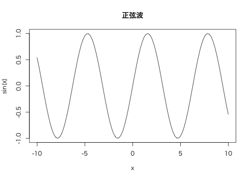
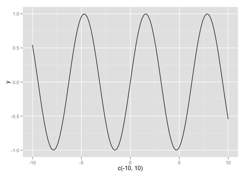

# Slidify

超簡単スライド作成

@kohske

---
### 手軽に資料を作りましょう

- markdown!!
- knitr!!
- slidify

やばいレベル。

---
### インストール

<pre class="knitr">
library(devtools)
install_github("slidify", "ramnathv")

</pre>

以下も必要かも。

<pre class="knitr">
install_github("knitr", "yihui")
install_github("whisker", "edwindj")
install_github("markdown", "rstudio")

</pre>

---
### コード評価ももちろんオーケー

<pre class="knitr">
ctl <- c(4.17, 5.58, 5.18, 6.11, 4.5, 4.61, 5.17, 
    4.53, 5.33, 5.14)
trt <- c(4.81, 4.17, 4.41, 3.59, 5.87, 3.83, 6.03, 
    4.89, 4.32, 4.69)
group <- gl(2, 10, 20, labels = c("Ctl", "Trt"))
weight <- c(ctl, trt)
lm.D9 <- lm(weight ~ group)

coef(lm.D9)

## (Intercept)    groupTrt 
##       5.032      -0.371 

</pre>

---
### プロットもオーケー

<pre class="knitr">
par(family = "sans")
curve(sin(x), -10, 10, main = "正弦波")

</pre>

---
### ggplot2もオーケー

<pre class="knitr">
library(ggplot2)
ggplot(NULL, aes(c(-10, 10))) + stat_function(fun = sin)

</pre>

---
## これはいいね。おしまい。
